# WIP

https://gerardfp.github.io/dam/m8/uf1/fragments/

Fragments
=========

El objetivo de esta práctica es trabajar con **Fragments**.

Un [Fragment](https://developer.android.com/reference/android/app/Fragment.html) representa un comportamiento o una parte de la interfaz de usuario en una [Activity](https://developer.android.com/reference/android/app/Activity.html).

Puedes combinar múltiples fragmentos en una sola actividad para crear una IU multipanel y volver a usar un fragmento en múltiples actividades. Puedes pensar en un fragmento como una sección modular de una actividad que tiene su ciclo de vida propio, recibe sus propios eventos de entrada y que puedes agregar o quitar mientras la actividad se esté ejecutando (algo así como una "subactividad" que puedes volver a usar en diferentes actividades).

Programaremos un proceso de [onboarding](https://greaterdanorequalto.com/dont-waste-time-on-onboarding/) para una app:


[https://github.com/gerardfp/fragments](https://github.com/gerardfp/fragments)

Vista general del componente Navigation
---------------------------------------

El componente Navigation consiste en tres partes clave:

1.  **Navigation Graph** (XML resource) - Es un recurso que contiene toda la información relativa a la navegación en un lugar centralizado. Esto incluye todos los lugares de la app, conocidas como **destinos**, y todos los caminos posibles que un usuario puede tomar en la app
    
    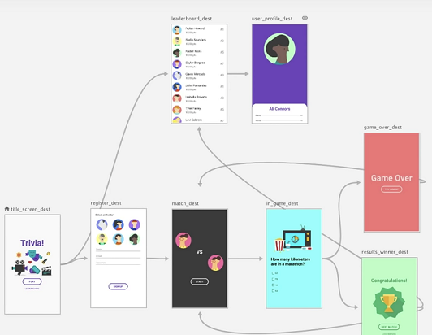
2.  **NavHostFragment** (Layout XML) - Es un widget especial que añades al layout. En él se muestran los diferentes destinos del Grafo de Navegación.
    
    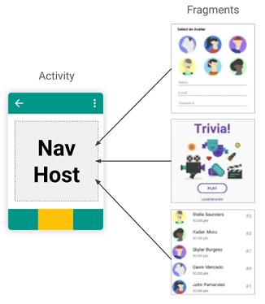
3.  **NavController** (Java object) - Es un objeto que realiza un seguimiento de la posición actual dentro del grafo de navegación. Realiza el intercambio del contenido de destino en el NavHostFragment según el usuario se mueve por el grafo de navegación.

Cuando navegas, utilizas el objeto NavController, diciéndole dónde quieres ir o qué camino quieres tomar en **Grafo de Navegación**. El NavController mostrará el destino apropiado en el NavHostFragment.

Crea el proyecto
----------------

1.  Selecciona Empty Activity como plantilla para la MainActivity
    
2.  Añade las dependencias para incluir el soporte Navigation:
    
    ``build.gradle`` 
    
    ```java
    dependencies {
    //...

      implementation "androidx.navigation:navigation-fragment:2.3.0
      implementation "androidx.navigation:navigation-ui:2.3.0
    } 
    ```
    
    *Puedes añadir las dependencias ahora mismo, o también puedes dejar que sea el propio Android Studio el que las añada automáticamente cuando crees el grafo de navegación en la siguiente sección.*
    

Crea el Grafo de Navegación
---------------------------

Sobre la carpeta raiz del proyecto haz clic-derecho y selecciona ``New > Android Resource File``

Introduce el nombre del fichero del grafo, por ejemplo: ``nav_graph``.  
En el ``Resource type`` selecciona ``Navigation``

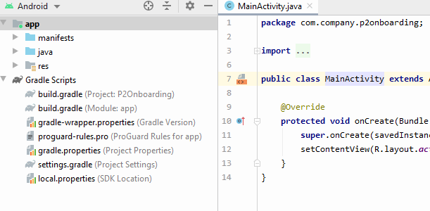

### Añade los fragments al grafo de navegación

Añadiremos 3 destinos al grafo de navegación. Dos destinos para el _Onboarding_, y uno que será la pantalla _Home_ de la app.

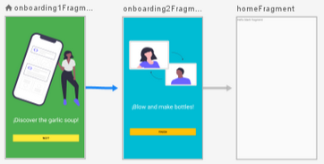

Abre el fichero ``res/navigation/nav_graph.xml`` en modo ``Design``, y haz click sobre el icono "**New Destination**" 

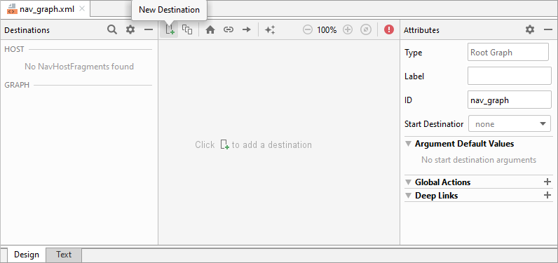

Haz click en ``Create new destination``

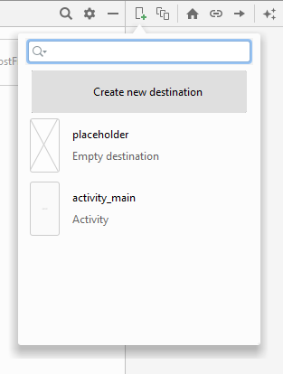

Seleciona ``Fragment (Blank)`` como plantilla para el Fragment:

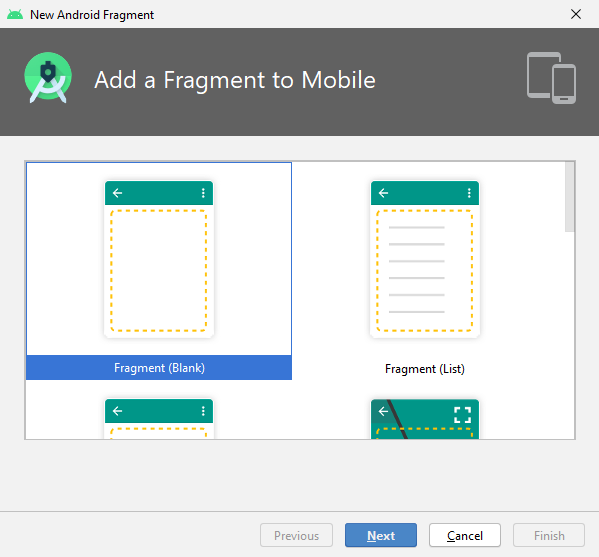

Introduce el nombre ``Onboarding1Fragment``:

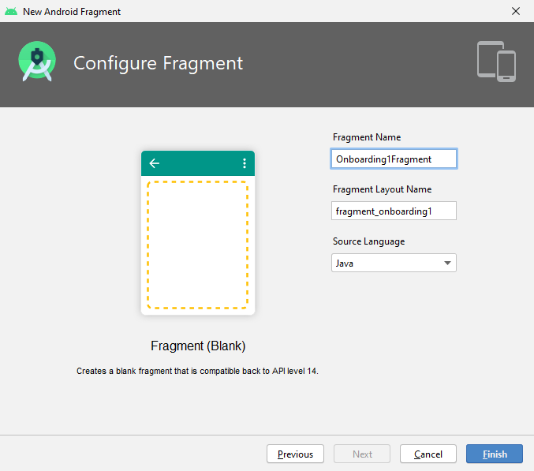

Repite el proceso para crear los fragments ``Onboarding2Fragment`` y ``HomeFragment``

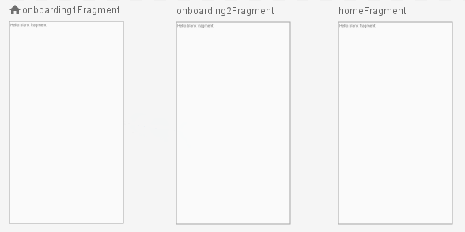

El icono  sobre el ``onboarding1Fragment`` indica que este es el destino que se mostrará en primer lugar: el **Start Destination**.

Puedes cambiar en cualquier momento el Start Destination seleccionando un destino y clicando en el icono  de la barra.

### Conecta los destinos

La navegación entre destinos se define creando **acciones** de navegación.

Para crear una **acción** hay que hacer clic sobre el manejador de orgien de un destino y arrastrarlo sobre el siguiente destino:

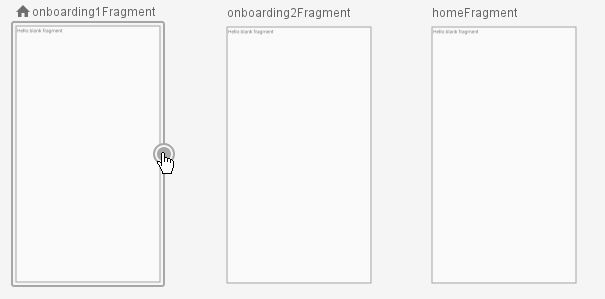

Crea las 2 acciones de navegación:

1.  Del ``onboarding1Fragment`` al ``onboarding2Fragment``
2.  Del ``onboarding2Fragment`` al ``homeFragment``

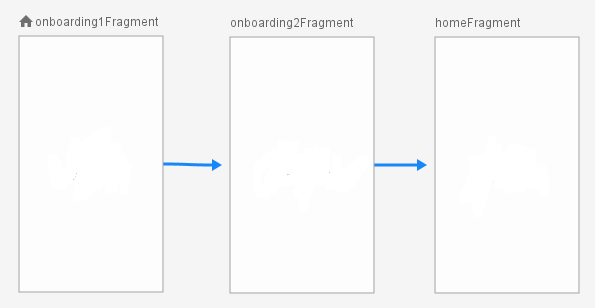

Observa que en el código XML del archivo ``res/navigation/nav_graph.xml`` se han añadido las ``<action>`` de navegación:

``res/navigation/nav_graph.xml``

```xml
...

<action
    android:id="@+id/action_onboarding1Fragment_to_onboarding2Fragment"
    app:destination="@id/onboarding2Fragment"/>
...

<action
    android:id="@+id/action_onboarding2Fragment_to_homeFragment"
    app:destination="@id/homeFragment" />
...
```

Más adelante utilizaremos los identificadores de estas acciones para implementar la navegación.

Añade el NavHost
----------------

En el layout de la ``MainActivity`` (``activity_main.xml``) añade un ``<FragmentContainerView>`` que será el NavHostFragment:

``res/layout/activity_main.xml`` 

```xml
<?xml version="1.0" encoding="utf-8"?>
<androidx.constraintlayout.widget.ConstraintLayout
    xmlns:android="http://schemas.android.com/apk/res/android"
    xmlns:app="http://schemas.android.com/apk/res-auto"
    android:layout_width="match_parent"
    android:layout_height="match_parent">

    <androidx.fragment.app.FragmentContainerView
        android:name="androidx.navigation.fragment.NavHostFragment"
        android:id="@+id/nav_host_fragment"
        android:layout_width="match_parent"
        android:layout_height="match_parent"
        app:defaultNavHost="true"
        app:navGraph="@navigation/nav_graph" />

</androidx.constraintlayout.widget.ConstraintLayout>
```

Puedes ver el ``NavHostFragment`` como un hueco en el cual se irán poniendo los diferentes destinos según se vaya navegando. Observa que lo hemos enlazado con el grafo de navegación que acabamos de crear mediante el atributo ``app:navGraph="@navigation/nav_graph"``

Diseña de las pantallas
-----------------------

### Añade las imágenes

Puedes descargar las imágenes del repositorio del proyecto:  
[onboarding1.svg](https://github.com/mdoradom/documentacion/post/fragments/onboarding1.svg)  
[onboarding2.svg](https://github.com/mdoradom/documentacion/post/fragments/onboarding2.svg)

O puedes usar las imágenes que quieras, por ejemplo de [unDraw](https://undraw.co), [DrawKit](https://www.drawkit.io/), [humaaans](https://www.humaaans.com/), [design.ai](https://designs.ai/graphicmaker/)...

Encima del directorio ``app``, haz clic-derecho y selecciona ``New > Vector Asset``

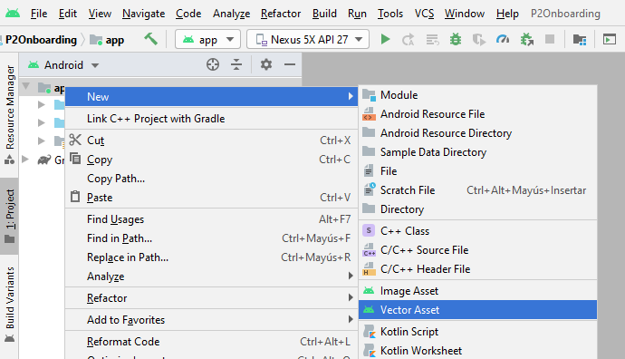

Selecciona ``Asset Type:`` **Local file** e introduce la ruta del fichero ``onboarding1.svg``:

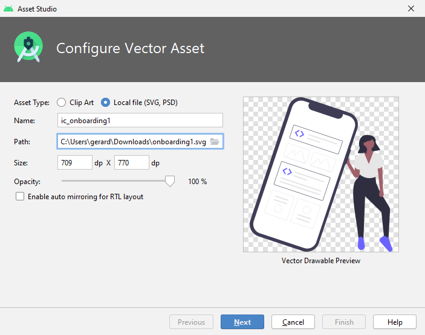

Repite lo mismo para la imagen ``onboarding2.svg``.

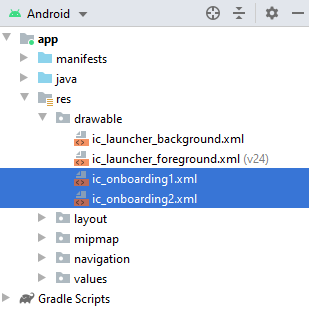

### Diseña el layout

Por defecto, el layout de los fragments creados contiene un ``FrameLayout``. Este layout está pensado para contener un único _child_. Cambiémoslo por un ``ConstraintLayout``:

Abre el fichero res/layout/fragment\_onboarding1.xml en modo Code y sustituye el FrameLayout por un ConstraintLayout:

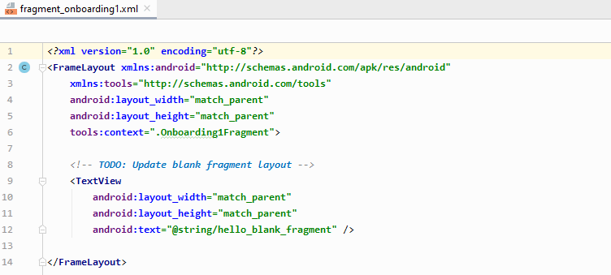

En cada pantalla añadiremos una imagen, un texto y un botón:

Para añadir una imagen usamos el widget ``ImageView``. La imagen que se debe mostrar se define en el atributo ``android:src``.

Es importante establecer el atributo ``android:adjustViewBounds`` a ``true``. Esto hace que los límites (el borde) del ``ImageView`` se ajusten al tamaño de la imagen.

```xml
<ImageView
android:layout_width="wrap_content"
android:layout_height="wrap_content"
android:adjustViewBounds="true"
android:src="@drawable/ic_onboarding1"/>
```

También puedes usar el modo **Design** para añadir la imagen:

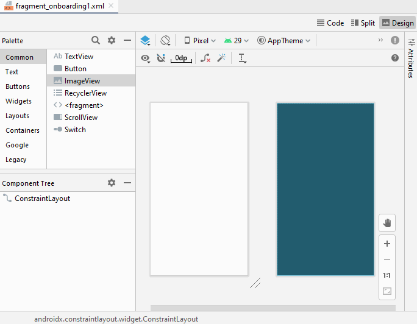 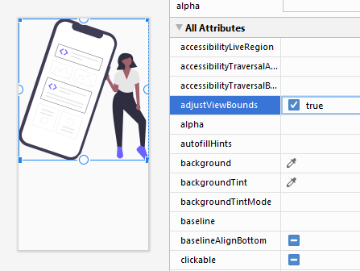 

Añadimos también el ``TextView`` y el ``Button``.

Modificamos algunos atributos para añadir colores de fondo, paddings, tamaños de letra, etc... También creamos las _constraints_ necesarias y definimos unos **identificadores** apropiados.

El layout ``fragment_onboarding1.xml`` queda finalmente así:

```xml
<?xml version="1.0" encoding="utf-8"?>
<androidx.constraintlayout.widget.ConstraintLayout xmlns:android="http://schemas.android.com/apk/res/android"
xmlns:app="http://schemas.android.com/apk/res-auto"
android:layout_width="match_parent"
android:layout_height="match_parent"
android:background="#4CAF50"
android:padding="32dp">

<ImageView
    android:id="@+id/imagen"
    android:layout_width="wrap_content"
    android:layout_height="wrap_content"
    android:adjustViewBounds="true"
    android:src="@drawable/ic_onboarding1"
    app:layout_constraintBottom_toTopOf="@+id/texto"
    app:layout_constraintTop_toTopOf="parent"
    app:layout_constraintLeft_toLeftOf="parent"
    app:layout_constraintRight_toRightOf="parent"/>

<TextView
    android:id="@+id/texto"
    android:layout_width="wrap_content"
    android:layout_height="wrap_content"
    android:text="!Discover the garlic soup!"
    android:textColor="#FFFFFF"
    android:textSize="30sp"
    app:layout_constraintBottom_toTopOf="@+id/botonSiguiente"
    app:layout_constraintTop_toBottomOf="@id/imagen"
    app:layout_constraintLeft_toLeftOf="parent"
    app:layout_constraintRight_toRightOf="parent"/>

<Button
    android:id="@+id/botonSiguiente"
    android:layout_width="match_parent"
    android:layout_height="wrap_content"
    android:backgroundTint="#FFEB3B"
    android:text="Next"
    app:layout_constraintTop_toBottomOf="@id/texto"
    app:layout_constraintBottom_toBottomOf="parent"
    app:layout_constraintLeft_toLeftOf="parent"
    app:layout_constraintRight_toRightOf="parent" />
</androidx.constraintlayout.widget.ConstraintLayout>
```

El resultado es este:

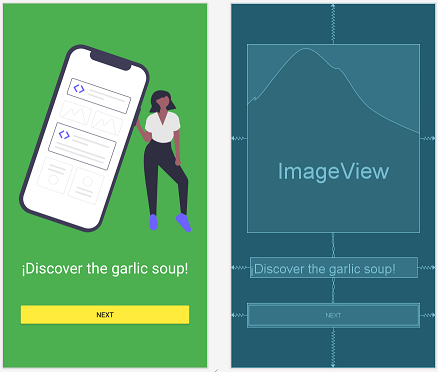

Para el ``fragment_onboarding2.xml`` cambiamos la imagen, el texto y los colores:

```xml
<?xml version="1.0" encoding="utf-8"?>
<androidx.constraintlayout.widget.ConstraintLayout xmlns:android="http://schemas.android.com/apk/res/android"
xmlns:app="http://schemas.android.com/apk/res-auto"
android:layout_width="match_parent"
android:layout_height="match_parent"
android:background="#00BCD4"
android:padding="32dp">

<ImageView
    android:id="@+id/imagen"
    android:layout_width="wrap_content"
    android:layout_height="wrap_content"
    android:adjustViewBounds="true"
    android:src="@drawable/ic_onboarding2"
    app:layout_constraintBottom_toTopOf="@+id/texto"
    app:layout_constraintLeft_toLeftOf="parent"
    app:layout_constraintRight_toRightOf="parent"
    app:layout_constraintTop_toTopOf="parent" />

<TextView
    android:id="@+id/texto"
    android:layout_width="wrap_content"
    android:layout_height="wrap_content"
    android:text="¡Blow and make bottles!"
    android:textColor="#FFFFFF"
    android:textSize="30sp"
    app:layout_constraintBottom_toTopOf="@+id/botonFinalizar"
    app:layout_constraintLeft_toLeftOf="parent"
    app:layout_constraintRight_toRightOf="parent"
    app:layout_constraintTop_toBottomOf="@id/imagen" />

<Button
    android:id="@+id/botonFinalizar"
    android:layout_width="match_parent"
    android:layout_height="wrap_content"
    android:backgroundTint="#FFC107"
    android:text="Finish"
    app:layout_constraintBottom_toBottomOf="parent"
    app:layout_constraintLeft_toLeftOf="parent"
    app:layout_constraintRight_toRightOf="parent"
    app:layout_constraintTop_toBottomOf="@id/texto" />
</androidx.constraintlayout.widget.ConstraintLayout>
```

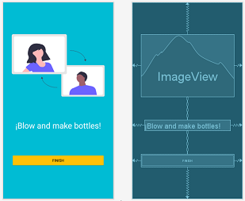

_El diseño de la pantalla Home la obviamos en esta práctica, ya que depende de la app que se vaya a implementar._

Implementa la Navegación
------------------------

El siguiente paso es añadir los _listeners_ a los botones para que al ser pulsados naveguen a la siguiente pantalla.

Abrimos el fichero ``Onboarding1Fragment.java``. En este fichero vemos un código _boilerplate_ generado por el asistente. Por el momento este código no nos interesa, así que **borramos** todo lo que hay antes del método ``onCreateView()``, hasta dejar la clase ``Onboarding1Fragment`` así:

``Onboarding1Fragment.java`` 

```java
public class Onboarding1Fragment extends Fragment {

    @Override
    public View onCreateView(@NonNull LayoutInflater inflater, ViewGroup container,
                                Bundle savedInstanceState) {
        return inflater.inflate(R.layout.fragment_onboarding1, container, false);
    }
}
```

**Con ViewBinding:**

```java
public class Onboarding1Fragment extends Fragment {

    private FragmentOnboarding1Binding binding;

    @Override
    public View onCreateView(@NonNull LayoutInflater inflater, ViewGroup container, Bundle savedInstanceState) {
        return (binding = FragmentOnboarding1Binding.inflate(inflater, container, false)).getRoot();
    }
}
```

Este método ``onCreateView()`` es similar a la llamada a ``setContentView()`` que vimos en la práctica anterior. Su función es **establecer el fichero de layout** para el Fragment, es decir, lo que se verá cuando se navegue a este fragment.

### Implementa el método onViewCreated()

De forma general, podemos decir que el código que se ha de ejecutar en un fragment se pone en el método ``onViewCreated()``. Este método lo ejecutará el Sistema Android una vez se haya establecido el layout del Fragment, es decir, cuando haya terminado el ``onCreateView()``.

Implementemos este método:

``Onboarding1Fragment.java``

```java
public class Onboarding1Fragment extends Fragment {

    @Override
    public View onCreateView(@NonNull LayoutInflater inflater, ViewGroup container, Bundle savedInstanceState) {
        return inflater.inflate(R.layout.fragment_onboarding1, container, false);
    }

    @Override
    public void onViewCreated(@NonNull View view, @Nullable Bundle savedInstanceState) {
        super.onViewCreated(view, savedInstanceState);
    }
}
```

### Añade los listeners a los botones

Tal como vimos en la práctica anterior, el primer paso será **vincular los botones** que hemos añadido en el layout XML **con variables Java**. Para ello usamos el método ``findViewById()``.

Cuando trabajamos con fragments las llamadas a ``findViewById()`` las realizaremos en sobre el parámetro view, del método ``onViewCreated()``. Este parámatro view que nos pasa el Sistema Android corresponde al layout que se creó en el método ``onCreateView()``.

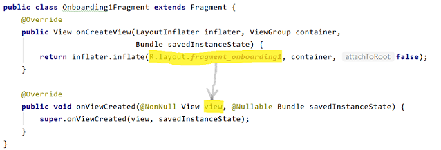

Declaramos la variable para el botón y usamos ``findViewById()`` para vincularlo al botón del XML:

``Onboarding1Fragment.java``

```java
public class Onboarding1Fragment extends Fragment {

    Button botonSiguiente;

    @Override
    public View onCreateView(@NonNull LayoutInflater inflater, ViewGroup container,
                                Bundle savedInstanceState) {
        return inflater.inflate(R.layout.fragment_onboarding2, container, false);
    }

    @Override
    public void onViewCreated(@NonNull View view, @Nullable Bundle savedInstanceState) {
        super.onViewCreated(view, savedInstanceState);

        botonSiguiente = view.findViewById(R.id.botonSiguiente);
    }
}
```

Si has usado ViewBinding, no es necesario crear la variable botonSiguiente ni llamar a findViewById(). Simplemente accede al botón con binding.botonSiguiente.

El segundo paso será añadir el _listener_ al botonSiguiente:

Onboarding1Fragment.java public class Onboarding1Fragment extends Fragment { Button botonSiguiente; @Override public View onCreateView(@NonNull LayoutInflater inflater, ViewGroup container, Bundle savedInstanceState) { return inflater.inflate(R.layout.fragment\_onboarding2, container, false); } @Override public void onViewCreated(@NonNull View view, @Nullable Bundle savedInstanceState) { super.onViewCreated(view, savedInstanceState); botonSiguiente = view.findViewById(R.id.botonSiguiente); botonSiguiente.setOnClickListener(new View.OnClickListener() { @Override public void onClick(View view) { // navegar al onboarding2 } }); } }

### Usa el NavController para navegar entre destinos

Para navegar a los diferentes destinos, android proporciona la clase NavController. Esta clase es la responsable de intercambiar en el NavHost los diferentes fragments de la app.

Para usar el NavController, primero lo guardamos en una variable con el método Navigation.findNavController(), y luego ya podemos llamar al método navigate() y pasarle la acción de navegacion que se debe realizar.

1.  Recuperamos el NavController con findNavController():
    
    Onboarding1Fragment.java public class Onboarding1Fragment extends Fragment { Button botonSiguiente; NavController navController; @Override public View onCreateView(@NonNull LayoutInflater inflater, ViewGroup container, Bundle savedInstanceState) { return inflater.inflate(R.layout.fragment\_onboarding2, container, false); } @Override public void onViewCreated(@NonNull View view, @Nullable Bundle savedInstanceState) { super.onViewCreated(view, savedInstanceState); navController = Navigation.findNavController(view); botonSiguiente = view.findViewById(R.id.botonSiguiente); botonSiguiente.setOnClickListener(new View.OnClickListener() { @Override public void onClick(View view) { // navegar al onboarding2 } }); } }
2.  Llamamos al metodo navigate() dentro del _listener_ para que navegue al siguiente Fragment cuando se haga clic en el botón:
    
    [Onboarding1Fragment.java](https://github.com/gerardfp/fragments/blob/master/app/src/main/java/com/company/p2onboarding/Onboarding1Fragment.java) public class Onboarding1Fragment extends Fragment { Button botonSiguiente; NavController navController; @Override public View onCreateView(@NonNull LayoutInflater inflater, ViewGroup container, Bundle savedInstanceState) { return inflater.inflate(R.layout.fragment\_onboarding2, container, false); } @Override public void onViewCreated(@NonNull View view, @Nullable Bundle savedInstanceState) { super.onViewCreated(view, savedInstanceState); navController = Navigation.findNavController(view); botonSiguiente = view.findViewById(R.id.botonSiguiente); botonSiguiente.setOnClickListener(new View.OnClickListener() { @Override public void onClick(View view) { navController.navigate(R.id.action\_onboarding1Fragment\_to\_onboarding2Fragment); } }); } }
    
    El parámetro pasado al método navigate() es el identificador de la **acción de navegación** que se debe realizar. En este caso del _onboarding1 al onboarding2_.
    

Repetimos el mismo proceso en el Onboarding2Fragment, cambiando el identificador del botón, y el identificador de la acción de navegación:

[Onboarding2Fragment.java](https://github.com/gerardfp/fragments/blob/master/app/src/main/java/com/company/p2onboarding/Onboarding2Fragment.java) public class Onboarding2Fragment extends Fragment { Button botonFinalizar; NavController navController; @Override public View onCreateView(@NonNull LayoutInflater inflater, ViewGroup container, Bundle savedInstanceState) { return inflater.inflate(R.layout.fragment\_onboarding2, container, false); } @Override public void onViewCreated(@NonNull View view, @Nullable Bundle savedInstanceState) { super.onViewCreated(view, savedInstanceState); navController = Navigation.findNavController(view); botonFinalizar = view.findViewById(R.id.botonFinalizar); botonFinalizar.setOnClickListener(new View.OnClickListener() { @Override public void onClick(View view) { navController.navigate(R.id.action\_onboarding2Fragment\_to\_homeFragment); } }); } }

**Ahora puedes ejecutar la app y probar la navegación.**

Añade transiciones a la navegación
----------------------------------

Por defecto la transición entre los destinos de navagación es bastante insulsa. Simplemente coloca un destino sobre otro.

Podemos personalizar la manera en que aparece el fragment de destino y la manera en que desaparece el fragment de origen.

Las transiciones de una acción de navegación (<action>) se definen en 4 atributos:

*   enterAnim y exitAnim: definen como entra el fragment destino y como sale el fragment origen, **cuando se navega "hacia adelante"**
*   popEnterAnim y popExitAnim: definen la transición **cuando se navega "hacia atrás"** (pulsando el botón atrás)

Android incorpora una serie de animaciones por defecto, y también permite definir tus propias animaciones. Haremos lo segundo.

### Define las animaciones

Para esta aplicación haremos que el fragment destino aparezca deslizándose desde la derecha, y el fragment origen desaparezca deslizándose hacia la izquierda:

Para ello, definiremos cuatro animaciones: slide\_in\_right, slide\_in\_left, slide\_out\_right y slide\_out\_left.

Sobre el directiorio app, haz clic-derecho y selecciona NewAndroid Resource File

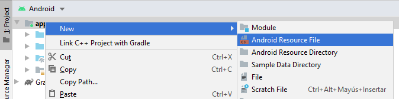

Introduce el nombre de la animación slide\_in\_right, y selecciona Animation como Resource Type:

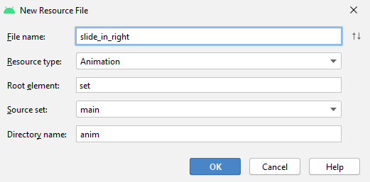

En el fichero res/anim/slide\_in\_right.xml que se ha creado, define la animación slide\_in\_right:

[slide\_in\_right.xml](https://github.com/gerardfp/fragments/blob/master/app/src/main/res/anim/slide_in_right.xml) <?xml version="1.0" encoding="utf-8"?> <set xmlns:android="http://schemas.android.com/apk/res/android"> <translate android:fromXDelta="100%" android:toXDelta="0%" android:duration="700"/> </set>

Define también la animación slide\_out\_left:

[slide\_out\_left.xml](https://github.com/gerardfp/fragments/blob/master/app/src/main/res/anim/slide_out_left.xml) <?xml version="1.0" encoding="utf-8"?> <set xmlns:android="http://schemas.android.com/apk/res/android"> <translate android:fromXDelta="0%" android:toXDelta="-100%" android:duration="700"/> </set>

La animación slide\_out\_right:

[slide\_out\_right.xml](https://github.com/gerardfp/fragments/blob/master/app/src/main/res/anim/slide_out_right.xml) <?xml version="1.0" encoding="utf-8"?> <set xmlns:android="http://schemas.android.com/apk/res/android"> <translate android:fromXDelta="0%" android:toXDelta="100%" android:duration="700"/> </set>

Y la animación slide\_in\_left:

[slide\_in\_left.xml](https://github.com/gerardfp/fragments/blob/master/app/src/main/res/anim/slide_in_left.xml) <?xml version="1.0" encoding="utf-8"?> <set xmlns:android="http://schemas.android.com/apk/res/android"> <translate android:fromXDelta="-100%" android:toXDelta="0%" android:duration="700"/> </set>

En las animaciones que hemos creado, simplemente realizamos un movimiento (translate) horizontal (fromXDelta 🡒 toXDelta).

Hay diversos tipos de animación que se pueden crear: transparencias, tamaños, rotación.

Para +info consulta: [Animación de vistas](https://developer.android.com/guide/topics/resources/animation-resource#View).

Además de las animaciones en la navegación, Android incorpora el MotionLayout para crear animaciones dentro de una "pantalla". Consulta [Construye animaciones con el Motion Editor](https://developer.android.com/studio/write/motion-editor)

### Asigna las animaciones a las acciones

Abre el fichero nav\_graph.xml y establece los siguientes atributos a las **dos** acciones:

[nav\_graph.xml](https://github.com/gerardfp/fragments/blob/master/app/src/main/res/navigation/nav_graph.xml) ... <action ... app:enterAnim="@anim/slide\_in\_right" app:exitAnim="@anim/slide\_out\_left" app:popEnterAnim="@anim/slide\_in\_left" app:popExitAnim="@anim/slide\_out\_right" /> ...

También lo puedes hacer en modo Design.

Selecciona cada acción y establece los atributos enterAnim, exitAnim, popEnterAnim y popExitAnim:

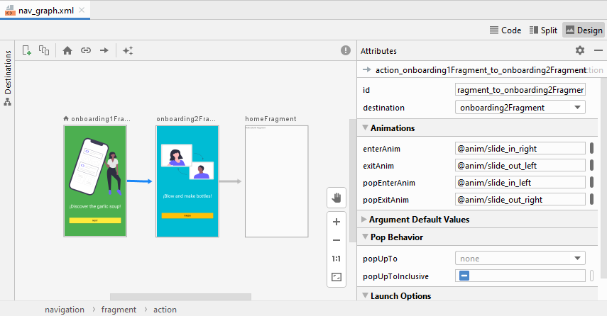

El resultado final es este:


Práctica: Onboarding
--------------------

Implementa un Onboarding de 3 pantallas. En las dos primeras debe haber una opción para omitir (_skip_). Utilitza diferentes animaciones en cada acción de navegación.

Ejemplo:

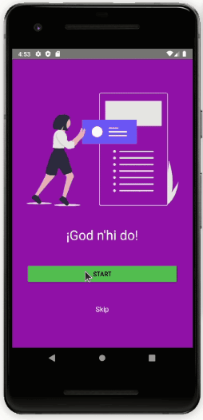

Grafo de navegación:

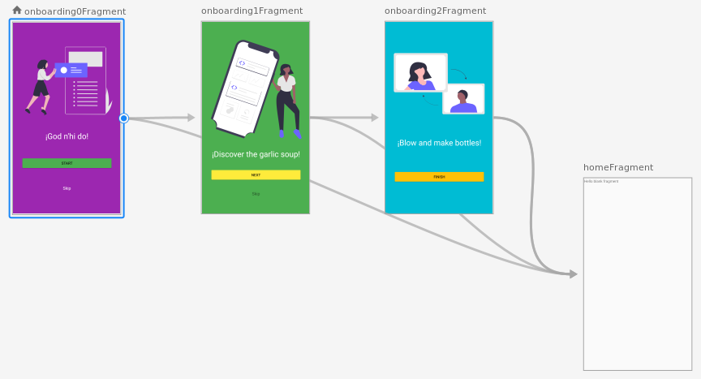

Webgrafía:

- [gerardfp.github.io](https://gerardfp.github.io/)